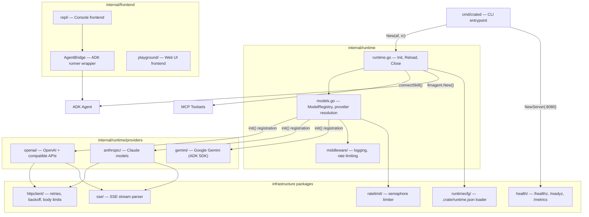
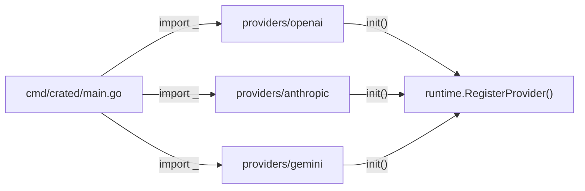

# crated — Architecture

> Agent runtime daemon — the container entrypoint that powers AI agents built with [AgentCrate](https://agentcrate.ai).
> Consumed as a binary by `crate run` and the Docker base image.

## Module Overview

```text
github.com/agentcrate/crated
```



## Startup Pipeline

`main()` → `Runtime.Init()` runs 4 sequential phases:

```text
┌───────────────────────────────────────────────────────────┐
│ Phase 1: NewModelRegistry() — resolve providers, connect  │
│          models, apply middleware (logger → rate limiter)  │
│ Phase 2: connectSkill() — stdio/http/sse MCP transports   │
│          + eager Tools() preload for fast first message    │
│ Phase 3: Resolve default model from registry              │
│ Phase 4: llmagent.New() — build ADK agent with tools      │
└───────────────────────────────────────────────────────────┘
```

**Phase 1** fails fast if the *default* model can't connect. Non-default failures produce warnings (graceful degradation).

**Phase 2** validates env vars (`checkSkillEnv`) before connecting, and eagerly calls `Tools()` so errors surface at startup rather than on the first user message.

## Two-Layer Configuration

| Layer | File | Set by | Contains |
| --- | --- | --- | --- |
| **Agentfile** | `Agentfile` | Developer | Models, persona, skills, tuning |
| **Runtime config** | `.crate/runtime.json` | `crate build` | API endpoints, auth env vars, host overrides |

API base URL resolution priority:

1. **Runtime env var** (`host_env_var`, e.g., `OLLAMA_HOST`) — deploy-time override
2. **Build-time config** (`api_base` from `runtime.json`)
3. **Provider default** (e.g., `https://api.openai.com/v1`)

## Provider Registration

Providers self-register via `init()` side-effect imports:



Each model is wrapped in a middleware chain: `Rate Limiter → Logger → Provider LLM`.

## Signal Handling

| Signal | Behavior |
| --- | --- |
| `SIGINT` / `SIGTERM` (1st) | Graceful shutdown: close skills, drain connections |
| `SIGINT` / `SIGTERM` (2nd) | Force exit |
| `SIGHUP` | Hot-reload: re-parse Agentfile, rebuild agent with new persona/brain, keep skill connections alive |

## Health Probes

| Endpoint | Type | Returns 200 |
| --- | --- | --- |
| `GET /healthz` | Liveness | Always (process is alive) |
| `GET /readyz` | Readiness | After models + skills initialized |
| `GET /metrics` | Diagnostics | Always (uptime, heap, goroutines, GC) |

## Container Image

```text
Stage 1 (builder):  golang:1.25-alpine → compile crated binary
Stage 2 (runtime):  alpine:3.21 → crated + Node.js (npx) + Python (uvx)
```

| Decision | Rationale |
| --- | --- |
| **tini** as PID 1 | Proper signal forwarding to Go process |
| Non-root `agent` user | Container security best practice |
| Node.js + Python | Pre-installed for stdio MCP tools (npx/uvx) |
| `HEALTHCHECK` directive | Docker Compose compatibility |
| Multi-arch (amd64+arm64) | Support for cloud and Apple Silicon |

## Dependencies

| Dependency | Purpose |
| --- | --- |
| `google.golang.org/adk` | ADK agent framework, runner, session, tool interfaces |
| `google.golang.org/genai` | GenAI types (Content, Part, FunctionCall) |
| `github.com/modelcontextprotocol/go-sdk/mcp` | MCP client transports (stdio, HTTP, SSE) |
| `github.com/agentcrate/agentfile` | Agentfile parsing and types |

## Testing Strategy

- **White-box** (`package runtime`): internal function access for provider registry, skill connect, reload
- **httptest-driven**: OpenAI and Anthropic providers test against mock HTTP servers
- **Stub LLM pattern**: `stubModel` / `stubProvider` for testing without real API calls
- **Registry isolation**: `saveAndRestoreProviders(t)` snapshots and restores the global registry per test
- **Coverage targets**: 80% patch coverage enforced via Codecov; `cmd/crated/main.go` excluded
- **CI**: tests on Linux + macOS matrix, golangci-lint, govulncheck, markdown lint
